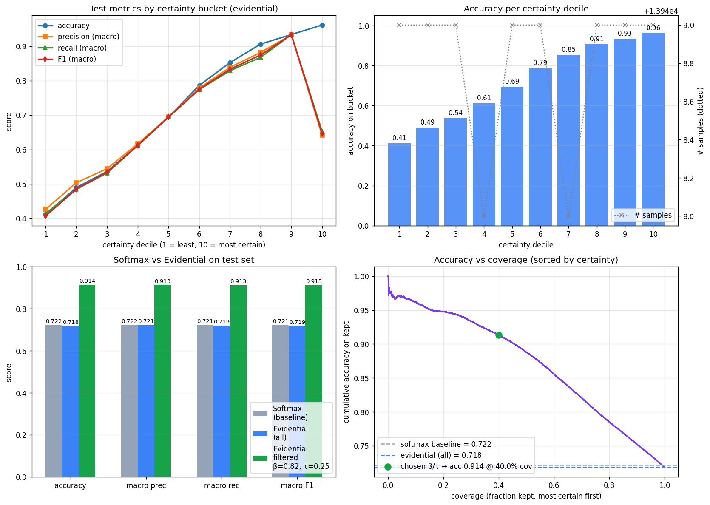

# DeepLOB + Evidential Uncertainty for Limit Order Books

A reproducible PyTorch implementation of **DeepLOB** (Zhang, Zohren & Roberts, IEEE TSP 2019), extended with a **Dirichlet / evidential head** (Sensoy et al., NeurIPS 2018) so the model can report calibrated uncertainty alongside its predictions and act only when it is confident.

| Model | Coverage | Accuracy | Macro F1 |
|---|---:|---:|---:|
| Softmax baseline | 100% | 0.722 | 0.721 |
| Evidential, no filter | 100% | 0.719 | 0.719 |
| **Evidential, filtered** (β=0.82, τ=0.25) | **40.0%** | **0.914** | **0.913** |

Filtering on `max p_k > β` AND `u < τ` lifts test accuracy from ~72% to ~91% on the 40% of windows we choose to act on. Per-class precision on the directional classes (down / up) rises from ~0.69 to ~0.91.



## What's in here

```
.
├── main.ipynb                  main notebook: train baseline → fine-tune evidential → compare
├── deeplob_data.py             FI-2010 caching + memmap-backed sliding-window Dataset
├── run_evidential.py           CLI: fine-tune the evidential head from a softmax checkpoint
├── run_comparison.py           CLI: head-to-head softmax vs evidential + plot
├── tests/
│   └── test_deeplob_data.py    regression tests for caching and sliding windows
├── checkpoints/
│   ├── best_val_model_pytorch.pt     softmax baseline
│   └── best_val_model_evidential.pt  evidential fine-tune
├── evidential_uncertainty.png  4-panel uncertainty analysis (in the notebook)
├── evidential_vs_softmax.png   4-panel head-to-head comparison
└── requirements.txt
```

## Quick start

### 1. Environment

Python 3.11 + PyTorch 2.x with CUDA recommended (CPU works but is slow).

```bash
conda create -n deeplob python=3.11 -y
conda activate deeplob

# Install PyTorch matching your CUDA version (https://pytorch.org for the right command).
# Then the rest:
pip install -r requirements.txt
```

### 2. Data

The notebook auto-downloads the FI-2010 archive on first run if the four `.txt` files are missing. The raw data are not stored in this repo (they are several hundred MB). They live at:

- Official source: https://etsin.fairdata.fi/dataset/73eb48d7-4dbc-4a10-a52a-da745b47a649
- Mirror used by the notebook: https://raw.githubusercontent.com/zcakhaa/DeepLOB-Deep-Convolutional-Neural-Networks-for-Limit-Order-Books/master/data/data.zip

After download, the first preprocessing cell caches each text file as a `float32` `.npy` memmap under `.cache/deeplob/`. Subsequent runs reuse the cache.

### 3. Run

Open and run `main.ipynb` top-to-bottom. The notebook is organised as one narrative:

1. The data: FI-2010, the 50-tick mid-price-move horizon, three classes (up / stable / down).
2. The model: CNN + Inception + LSTM, exactly as in the paper.
3. Train the baseline: cross-entropy, Adam, AMP, early-stopping.
4. Evaluate the baseline: test accuracy + per-class precision + inference latency.
5. Add the evidential head: replace softmax with softplus; fine-tune with expected-MSE + KL.
6. Compare: head-to-head metrics + accuracy by certainty decile + selective-trading rule.

To reproduce from the CLI without Jupyter:

```bash
# 1. Train the softmax baseline first (this is the original notebook flow up to the test cell)
#    Or load the included checkpoint:  checkpoints/best_val_model_pytorch.pt

# 2. Fine-tune the evidential head from the softmax checkpoint
python run_evidential.py

# 3. Run the head-to-head comparison and generate evidential_vs_softmax.png
python run_comparison.py
```

## Method in one paragraph

The backbone (`conv1..3` → Inception → LSTM) is unchanged from the paper: pair-aggregating `(1,2)` conv → short-tick `(4,1)` convs → `(1,10)` collapse across levels → multi-scale Inception → single-layer LSTM(192→64). For the evidential variant, the final activation changes from `softmax` to `softplus`, producing three non-negative *evidences* `e`. We form Dirichlet parameters `α = e + 1`, predicted probability `p = α / S` (with `S = Σα`), and a scalar uncertainty `u = K / S ∈ (0, 1]`. The training loss is the expected MSE on `p` plus a KL regulariser that penalises evidence assigned to wrong classes, annealed from 0 to 1 over the first ten epochs. We warm-start from the trained softmax checkpoint, so fine-tuning is short (~15 epochs at `lr=1e-4`). At inference, the selective-prediction rule is:

> **act only if `max p_k > β` AND `u < τ`** ; otherwise stay flat.

Thresholds `(β, τ)` are picked on the validation set under a coverage floor of 10%, and never tuned on the test set.

## Results summary

**Overall metrics on the held-out test set (139,488 windows):**

| Model | Coverage | n kept | Accuracy | Macro Prec | Macro Rec | Macro F1 |
|---|---:|---:|---:|---:|---:|---:|
| Softmax (baseline) | 100% | 139,488 | 0.7216 | 0.7224 | 0.7209 | 0.7213 |
| Evidential (no filter) | 100% | 139,488 | 0.7185 | 0.7212 | 0.7189 | 0.7187 |
| **Evidential filtered** (β=0.82, τ=0.25) | **40.0%** | 55,764 | **0.9137** | **0.9130** | **0.9126** | **0.9127** |

**Per-class precision** (0 = down, 1 = stable, 2 = up):

| Model | Down | Stable | Up |
|---|---:|---:|---:|
| Softmax (baseline) | 0.6892 | 0.7857 | 0.6923 |
| Evidential (no filter) | 0.7107 | 0.7977 | 0.6551 |
| **Evidential filtered** | **0.9146** | **0.9279** | **0.8964** |

**Accuracy rises monotonically with certainty.** Binning the test predictions into 10 equal-mass deciles by `1 − u`:

| Certainty decile | 1 | 2 | 3 | 4 | 5 | 6 | 7 | 8 | 9 | 10 |
|---|---:|---:|---:|---:|---:|---:|---:|---:|---:|---:|
| Accuracy | 41% | 49% | 54% | 61% | 69% | 79% | 85% | 91% | 93% | **96%** |

The uncertainty signal is real: the most-confident decile is correct 96% of the time, the least-confident is barely above chance.

## Tests

```bash
python -m pytest tests/ -q
```

Covers caching, sliding-window construction, and dtype invariants for the FI-2010 data path.

## References

1. Ntakaris A, Magris M, Kanniainen J, Gabbouj M, Iosifidis A. *Benchmark dataset for mid-price forecasting of limit order book data with machine learning methods*. Journal of Forecasting, 2018. https://arxiv.org/abs/1705.03233
2. Zhang Z, Zohren S, Roberts S. *DeepLOB: Deep convolutional neural networks for limit order books*. IEEE Transactions on Signal Processing, 2019. https://arxiv.org/abs/1808.03668
3. Sensoy M, Kaplan L, Kandemir M. *Evidential Deep Learning to Quantify Classification Uncertainty*. NeurIPS, 2018. https://arxiv.org/abs/1806.01768

## Notes

- Tested on PyTorch 2.11 + CUDA 12.8 with an RTX 5070 Ti (16 GB).
- AMP (`torch.autocast`, `torch.amp.GradScaler`) is enabled when CUDA is available.
- `.cache/` and per-epoch checkpoints are gitignored, only `best_val_model_*.pt` are tracked.

## Author

[@tri2911](https://github.com/tri2911) — feel free to open an issue if you hit anything weird reproducing it.
